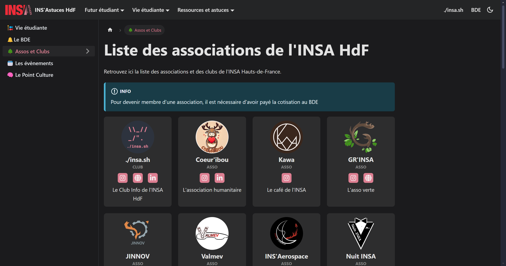
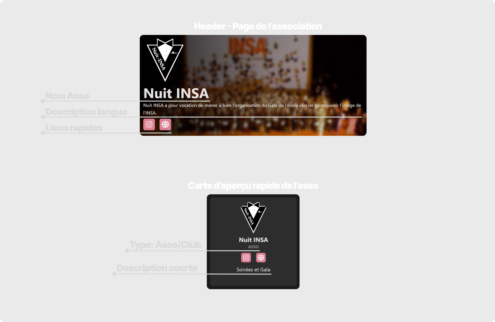
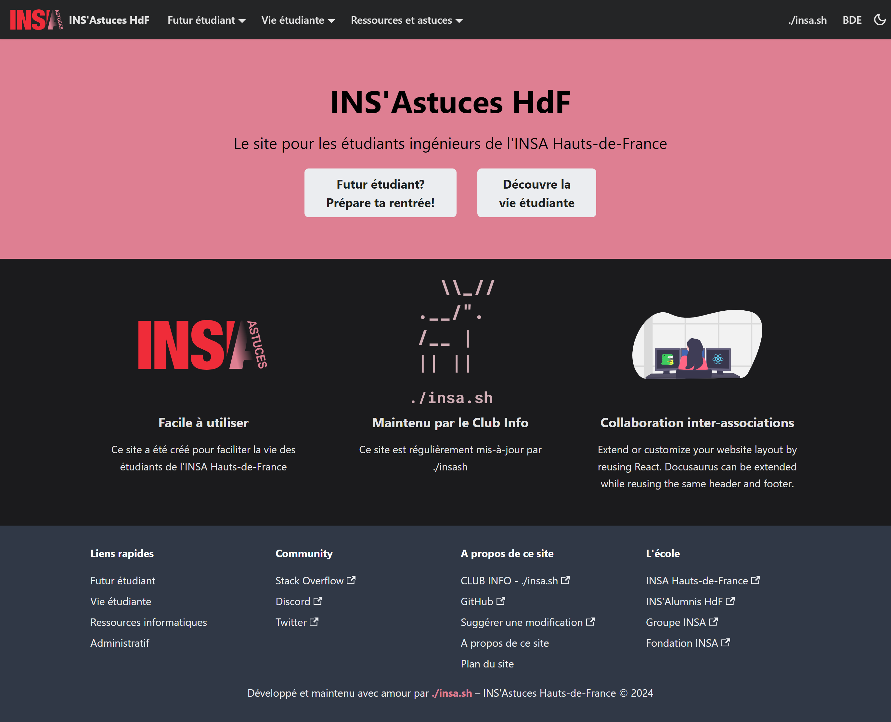
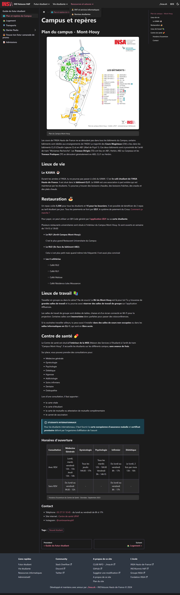

 

# INS'Astuces HdF 
_L'objectif est de créer un site web simple maintenu par les étudiants pour les étudiants ingénieurs de l'INSA Hauts-de-France qui répertoriera toutes les informations importantes à savoir pour leur scolarité et leur vie étudiante._

 

> **Note :** 
> Le site n'est accessible qu'en pré-version pour le moment.

 

## Contenu du site

Les premiers contenus de ce site seront:
- Un guide pour les futurs étudiants
    - Plan du campus et points repères
    - Transports
    - Logement
    - Admissions
    - Starter Packs
        - 1A, 2A et 3A : comment bien démarrer l'année et apréhender les cours
        - Méthodes de travail
    - Discuter avec les étudiants actuels
- Vie étudiante
    - Le BDE, ça sert à quoi?
    - Liste des assos de l'INSA HdF
    - Les évènements annuels
- Conseils et tutos info
    - Les logiciels et services fournis par l'UPHF
    - Comment synchroniser ses mails avec une application mobile poru reçevoir les notifs
    - Les meilleures réducs étudiantes sur les logiciels
- Administratif
    - Contacts utiles - responsables des SPE...
    - Fiches d'abscences, syllabus...

 

# Les pages des association
Chaque association possède sa propre page sur INS'Astuces. Vous pouvez **personnaliser la page de votre asso** en changeant le logo, l'image d'arrière-plan, la description ou encore les liens affichés... 

Vous pouvez aussi créer une page complète pour présenter votre association, ses activités, ses membres, ses évènements... (au format markdown)

## Ajouter - modifier la page de mon asso

Pour modifier les informations - logo - photos - liens associés à votre asso, `ouvrez une issue` sur ce dépôt en précisant les modifications à apporter. N'hésitez pas à joindre en pièce jointe les logos ou images que vous souhaitez modifier ou ajouter.

[> Demander une modification [ouvrir une issue]](https://github.com/billyTheSecond/INSAstuces/issues/new)

> **Note :** 
> Si vous ne voulez pas demander publiquement une modification, vous pouvez contacter directement un des contributeurs du projet.

## Ajouter une nouvelle Asso
Pour ajouter une association, c'est la même procédure! Ouvrez une issue `en précisant les informations indiquées ci-dessous` et les images à joindre. Les responsables du projet INS'Astuces se chargeront de publier les modifications !

[Ouvrir une issue pour ajouter une association ou un club](https://github.com/billyTheSecond/INSAstuces/issues/new)

**Informations à fournir**
- Nom de l'association
- Logo
- Statut (club ou asso)
- Liens des réseaux à mettre en avant _(conseillé: 2 à 3 liens max)_
- Description courte _(<= 80 caractères espaces compris) à mettre sur la page [astuces.insahdf.fr/vie-etudiante/assos-et-clubs](https://astuces.insahdf.fr/vie-etudiante/assos-et-clubs)_
- Description plus détaillée _(<= 250 caractères espaces compris) à mettre sur la page dédiée à l'association_
- Cover de la page asso (note: l'image de fond est floutée)

    > **Logo**
    > - **Ratio:** Logo carré  
    > - **Résolution idéale:** 600px x 600px 
    > - **Formats acceptés:** favoriser .svg et .webp  (les autres formats seront convertis en .webp)  
    > - **Note:** Si votre logo a un fond transparent, assurez-vous qu'il soit bine lisible sur un fond noir et un fond blanc (que le logo soit bien adapté aux modes nuit et jour)

    >  **Exemples de liens pertinents**
    >- Site internet
    >- Instagram
    >- Lien d'invitation Discord
    >- LinkedIn
    >- Spotify/Deezer...

### Exemple des aperçus

### Ajouter du contenu à la page de mon asso
Chaque asso possède par défaut une page avec une bannière. Il est possible de rajouter du contenu à cette page pour mettre en avant vos activités, vous présenter. Ce site sera principalement consulté par les futurs étudiants, c'est ici que vous pourrez séduire vos futures recrues.

Le contenu de cette page sera écrit en `Markdown`. Vous ne savez pas ce que c'est ? Pas de soucis! Envoyez-nous ce que vous voulez y mettre et on se chergera de le mettre dans le bon format.

# Aperçus des pages

# Rejoindre le projet
Tu veux faire partie du projet ? Passe nous voir au Club info ou rejoins notre Discord pour en discuter !

# Développement
Plus d'informations sur : [Développement](INSAstuces/README.md)

> Inspirations : [WikiEtud INSA Toulouse](https://wiki.etud.insa-toulouse.fr/)